# claude-starters

**Token-lean project starters, on-demand clean-code skills, a scoped 76-agent
library, and cost-aware auto-launch orchestration — for Claude Code.**

[Demo](#demo) · [Why](#why) · [Install](#install) · [How it works](#how-it-works) · [Orchestration](#orchestration) · [Starters](#starters) · [Agents](#agents) · [Config](#configuration) · [Flags](#flags) · [FAQ](#faq)

## Demo

Pick a stack, get a framework-locked `CLAUDE.md` plus exactly the agents that stack
needs — and **`git status` stays empty**. Everything it writes is ignored locally, so
your repo is byte-for-byte what it was before.

## Why

A general-purpose `CLAUDE.md` spends your context budget on rules that don't apply.
Rust guidance sitting in a Python repo isn't free — it's read every turn, and it
crowds out the code you actually care about.

claude-starters takes the opposite approach:

- **Only the rules for your stack.** A starter is a small, opinionated `CLAUDE.md`
  for one language, with the framework pinned so the agent stops re-litigating it.
- **Depth on demand.** The `clean-code-*` skills stay dormant and cost ~nothing at
  rest; they fire when you touch code they apply to.
- **Agents you can actually find.** 76 is too many to browse. Applying a starter
  activates the ~14 that matter for that stack, so the picker stays useful.
- **Zero repo footprint.** Nothing is committed, nothing enters your `.gitignore`,
  and collaborators never see a trace.

## Install

    /plugin marketplace add CassetteTapeCrackle/claude-starters
    /plugin install claude-starters

Bundles the `/apply-starter` command, the `clean-code-*` + `agent-orchestration`
skills, the global agents, and the orchestration hooks. Enable / disable /
uninstall entirely through `/plugin` — no manual file surgery, nothing written
to your `~/.claude/`.

While the plugin is enabled, `apply-starter.sh` is also on the Bash tool's `PATH`,
so the agent can call it directly in any shell step.

## Quick start

### Greenfield
After brainstorming settles on a language + framework:

    /apply-starter python --framework fastapi

### Existing repo
Open an existing repo and the plugin **detects the stack** (`Cargo.toml`,
`package.json`, …) and **offers** to apply the matching starter — once per repo,
opt-in. If the repo already has a `CLAUDE.md`, it appends the rules
non-destructively via `--add` (your file is never overwritten). Decline and the
repo is left completely untouched — the "already suggested" flag lives in
`~/.claude/`, not in your project.

### Multi-language monorepo
Apply different starters to different subtrees; each gets its own scoped,
locally-ignored `CLAUDE.md`:

    /apply-starter rust --framework axum --path backend
    /apply-starter web-ts --path frontend

## How it works

### What gets written
Applying `<stack>` to a directory produces:

| Path | Purpose |
|---|---|
| `CLAUDE.md` | The starter's rules, with `__FRAMEWORK__` replaced by your choice |
| `.claude/agents/*.md` | The stack's agents, copied from `agent-library/` |
| `.claude/.starter-applied` | Which stacks are active here (one per line) |
| `.claude/.starter-state` | `stack<TAB>framework`, so `--update` can refresh without re-typing |

### Why your repo stays clean
The generated paths are appended to **`.git/info/exclude`**, not to `.gitignore`.
That distinction matters: `.git/info/exclude` is per-clone and never committed, so
your teammates see nothing, no diff is produced, and you don't have to negotiate a
`.gitignore` change to try the tool. Outside a git repo, files are written normally
and nothing is excluded.

### Staying in sync
Rules live between markers:

    <!-- claude-starters:rules begin -->
    …managed content…
    <!-- claude-starters:rules end -->

`--update` rewrites only what's between them, so edits you make outside the block
survive. If a file is missing either marker, the tool refuses to touch it rather
than guess.

## Orchestration

The tagline's "cost-aware auto-launch" is two hooks, and neither one calls a model.

### Session start
`session-reflex.sh` injects the orchestration reflex as session context — the
plugin-native alternative to editing your `~/.claude/CLAUDE.md`, so it disappears
cleanly when you disable the plugin. `detect-existing-stack.sh` runs alongside it
and surfaces the once-per-repo starter suggestion described above.

### Turn end
`stop-orchestrator.sh` fires on the Stop event in a starter-applied project. It
scans the working-tree diff for risk patterns tied to your active stacks and
surfaces matching specialist agents.

What makes it cheap:

- **No LLM in the loop.** It's `git diff` plus pattern matching — deterministic
  and free.
- **Debounced by candidate set, not by diff.** Iterating on the same risk never
  re-nags, and it cannot loop.
- **Fail-safe.** Every hook traps errors and exits 0; a broken hook can never
  wedge your session.
- **Silent by default.** No applied starter, no diff, or no match means no output.

## Configuration

Both hooks are on by default. Claude Code prompts for these when you enable the
plugin, and `/plugin` can change them later — no file editing, and skipping the
prompts leaves everything on.

| Option | What turning it off does |
|---|---|
| **Offer a starter in existing repos** | Session start stops suggesting a starter for unconfigured repos. |
| **Surface specialist agents at turn end** | Turn end stops scanning the diff for risk patterns. |

The hooks read these as `CLAUDE_PLUGIN_OPTION_SUGGEST_ON_EXISTING_REPOS` and
`CLAUDE_PLUGIN_OPTION_TURN_END_ORCHESTRATOR`. Unset means enabled, so the default
path costs you nothing.

## Starters
**Languages:** python · cpp · c · rust · go · bash-tooling · python-cli · python-data
**Web/backend:** web-ts · node-api · electron · tauri
**Audio:** audio-plugin · audio-app · web-audio · audio-external (max/pd) · faust
**Mobile/desktop:** swiftui · android · flutter
**ML/infra:** python-ml · terraform · docker

`apply-starter --list` prints them; `apply-starter --list rust` dumps one manifest.

## Skills
Depth skills that auto-fire on relevant code and cost ~nothing at rest:

clean-code-cpp · clean-code-audio · clean-code-rust · clean-code-go ·
clean-code-python · clean-code-bash · clean-code-c · clean-code-ts

## Agents

**76 total** — a 68-agent scoped library (`agent-library/`) surfaced *per codebase*
so you only ever see the relevant few, plus 8 global agents.

### Global
Installed once, always available: `starter-author`, `dep-auditor`, and the
stack-agnostic product agents (`idea-brainstormer`, `product-critic`,
`naming-agent`, `release-copywriter`, `demo-script-writer`, `competitor-analyst`).

### Common
Activated into every applied project: conformance, debugger, regression-hunter,
test-author, prd-writer, spec-critic, technical-writer, deep-researcher,
migration-agent, perf-profiler.

### Per-stack
Language and domain auditors the starter brings with it — `audio-plugin` adds
`rt-safety-auditor`, `dsp-golden-test-author`, `pluginval-runner`; `rust` adds
`unsafe-auditor`, `lifetime-untangler`; and so on.

Mixing stacks in one directory? `/apply-starter <stack> --add` layers a second
set in. See [`docs/agent-ideas-backlog.md`](docs/agent-ideas-backlog.md) for the
full catalogue.

## Flags

    apply-starter <stack> [--framework <name>] [--path <subdir>]
                          [--add | --update | --force] [--no-agents]
                          [--dry-run] [--print]
    apply-starter --list [<stack>]
    apply-starter --version | --help

| Flag | Effect |
|---|---|
| `--framework <name>` | Pin the framework substituted into the template. Defaults to `none`. |
| `--path <subdir>` | Apply to a subtree. Must be relative and free of `..`. |
| `--add` | Append the managed block to an existing `CLAUDE.md`. Never overwrites. |
| `--update` | Refresh the managed block in place. Infers stack and framework from `.starter-state` when omitted. |
| `--force` | Overwrite an existing `CLAUDE.md`, backing the old one up to `CLAUDE.md.bak`. |
| `--no-agents` | Write the `CLAUDE.md` only; activate no agents. |
| `--dry-run` | Report the target, the agents, and the exclude lines. Writes nothing. |
| `--print` | Render the resolved `CLAUDE.md` to stdout. Writes nothing. |
| `--list [<stack>]` | List every stack, or dump one stack's `manifest.json`. |

Two environment variables override discovery, mostly for testing:
`CLAUDE_STARTERS_DIR` and `CLAUDE_AGENT_LIB`.

## FAQ

**Will this overwrite my existing `CLAUDE.md`?**
No. Without a flag it refuses and tells you to pick `--add`, `--update`, or
`--force`. Only `--force` overwrites, and it backs up to `CLAUDE.md.bak` first.

**Does it modify my `.gitignore`?**
Never. It appends to `.git/info/exclude`, which is local to your clone and is
not committed.

**What if I'm not in a git repo?**
Files are written normally; the exclude step is skipped.

**How do I undo it?**
Delete `CLAUDE.md` and `.claude/`, then drop the lines from `.git/info/exclude`.
Nothing else was touched.

**Can I preview before committing to it?**
`--dry-run` shows what would happen; `--print` shows the exact `CLAUDE.md` you'd get.

**Does the orchestrator cost tokens?**
Not at rest. It's git plus pattern matching, and it only speaks when a new risk
pattern appears in your diff.

## Extend
Add `starters/<stack>/{CLAUDE.md,manifest.json}` + a content test; optionally
a `skills/clean-code-<x>/SKILL.md` (auto-discovered by the plugin). Or ask the
`starter-author` agent. Everything is TDD'd (plain-bash harness) and
shellcheck-clean.

## Test
    for t in tests/*.test.sh; do bash "$t"; done
    shellcheck bin/apply-starter.sh hooks/*.sh tests/*.sh

## Contributing
Issues and PRs welcome — see [CONTRIBUTING.md](CONTRIBUTING.md). New starters are
the most useful contribution; the bar is a `manifest.json`, a lean `CLAUDE.md`,
and a content test.

## License
MIT — see [LICENSE](LICENSE).
